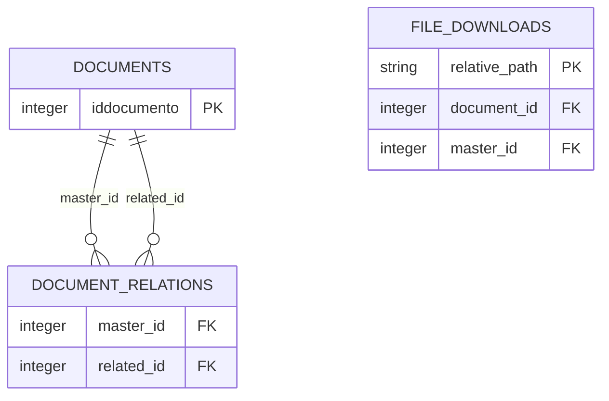

# Modelo De Datos Local

## Alcance

Cada contexto de salida usa dos bases SQLite independientes:

| Archivo | Entidades | Proposito |
| --- | --- | --- |
| `cargos_sgd.sqlite` | `documents`, `document_relations`, `metadata` | Registro documental, relaciones y contexto sincronizado |
| `descargas_archivos.sqlite` | `file_downloads` | Estado reanudable de adjuntos locales |

El esquema ejecutable vive en [storage.py](../src/cargos_downloader/storage.py).
No hay migraciones separadas: `init_database` y `init_file_catalog` crean y
actualizan el esquema al abrir cada base.

## Diagrama

`file_downloads` esta en otra base, por lo que sus referencias no son claves
foraneas SQLite. Se materializan al construir tareas desde los documentos y sus
relaciones.

## Diccionario

| Nombre de dominio | Tabla SQLite | Responsabilidad |
| --- | --- | --- |
| `Document` | `documents` | Registro de un documento principal o relacionado recibido del SGD. |
| `DocumentRelation` | `document_relations` | Vínculo lógico entre un documento principal y uno relacionado. |
| `FileDownload` | `file_downloads` | Estado reanudable de cada adjunto descargable. |

### `documents`

Una fila representa un documento principal o relacionado recibido del SGD.
`iddocumento` es la clave primaria dentro de la base del contexto activo.
`period`, `scope` y `depe_id` delimitan consultas y reportes; `relation_kind`
distingue principal de relacionado. `raw_json` conserva el payload recibido para
reconstruir archivos y campos no normalizados.

Indices relevantes: reporte por contexto/tipo/fecha/numero, principales por
contexto y relacionados por principal.

### `document_relations`

Representa cada vinculo principal-relacionado. Su clave compuesta es
`period, scope, depe_id, master_id, related_id`; conserva tambien el JSON de la
relacion. Una relacion puede apuntar a un documento que tambien sea principal,
por eso la relacion no se guarda solo como una columna del documento.

### `metadata`

Guarda la version de esquema y el contexto activo. Sus claves incluyen
`context.period`, `context.scope` y `context.depe_id`. Cambiar el contexto hace
que la sincronizacion reemplace la base documental activa.

### `file_downloads`

Cada fila representa un destino fisico de un adjunto. `relative_path` es la
clave porque un mismo archivo remoto puede requerirse bajo carpetas de
principales distintos. Conserva `file_id`, `document_id`, `master_id`, nombre,
tipo, tamano esperado, estado, intentos, ultimo error y fechas.

Los estados son `pendiente`, `descargado` y `error`. Un archivo existente con
tamano valido se registra como descargado aunque no se transfiera de nuevo.

## Integridad Y Retencion

- La aplicacion no guarda claves ni tokens en SQLite.
- `Limpiar base` elimina solo `cargos_sgd.sqlite`; conserva adjuntos y
  `descargas_archivos.sqlite`.
- `Cambiar usuario` elimina las bases documentales del usuario actual; los
  archivos fisicos no se eliminan automaticamente.
- Las relaciones y datos remotos son una copia local; el SGD es la fuente
  autoritativa.

## Verificacion

Ejecutar la compilacion descrita en [procedimientos.md](procedimientos.md) y
realizar una sincronizacion de prueba. La cardinalidad fisica y las claves se
verifican leyendo las sentencias `CREATE TABLE` de `storage.py`; no hay una
prueba automatizada de esquema en el repositorio todavia.
